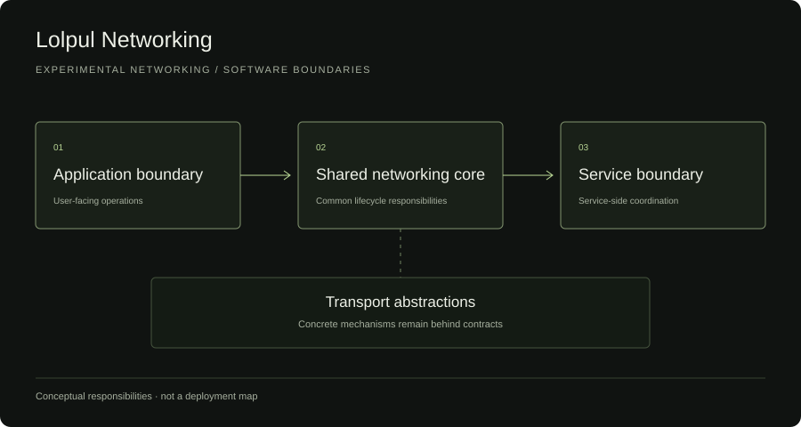

# Networking Systems

Three small Go examples of cancellation, lifecycle coordination, and resource ownership, alongside a conceptual overview of an experimental networking project.

## What this demonstrates

- An explicit `io.WriteCloser` ownership boundary and serialized lifecycle operations.
- Cooperative context cancellation followed by joining a worker goroutine.
- Reverse-order cleanup after partial acquisition, with operation and cleanup errors preserved.
- Deterministic channel-based tests and concurrent access checked with Go's race detector.

## Architecture

The private experimental project separates application behavior, logical sessions, and concrete transports. This public repository demonstrates generic lifecycle concerns without implementing that network stack.



The examples are independent packages: a writer session owns one writer; a task owns one worker; a scoped operation owns two temporary resources. Their tests use synthetic in-process dependencies. There is no network connection or provider integration.

## Code examples

| Example | Start reading | Contract |
| --- | --- | --- |
| Session lifecycle | [writer.go](examples/session-lifecycle/writer.go) | The caller transfers ownership; writes serialize; close waits for an active write and runs once. |
| Cancellation | [task.go](examples/cancellation/task.go) | Work honors context cancellation; `Stop` cancels and joins; all waiters observe the same result. |
| Resource cleanup | [scope.go](examples/resource-cleanup/scope.go) | Each acquired resource is closed once, including resource-plus-error returns; cleanup unwinds in reverse order. |

## Engineering decisions

A mutex protects the writer operation and its lifetime together, avoiding a close/write race at the cost of blocking other calls during a write. A task uses channel closure to publish its result after cleanup; cancellation by itself does not establish that the worker has exited. Scoped acquisition uses `defer` and `errors.Join` so a cleanup error does not erase the original failure.

These APIs were written independently for the public examples. They are intentionally smaller and different from the private project's contracts. See [interview notes](docs/interview-notes.md) for alternatives and trade-offs, and [the scope specification](docs/spec.md) for acceptance criteria.

## Failure handling

A failed close is retained rather than retried. Writing after shutdown is rejected. A short write becomes `io.ErrShortWrite`. Expired work is not started. Acquisition failures still release any resource returned alongside the error. Cancellation between acquisition steps skips further work and releases owned resources.

## Tests

With Go 1.26.4:

```sh
gofmt -l examples
go vet ./...
go test -timeout 30s ./...
go test -race -timeout 30s ./...
```

[GitHub Actions](https://github.com/lolpul/lolpul-networking-showcase/actions/workflows/go.yml) runs formatting, vet, host tests, and race tests on Linux. Tests cover success, worker failure, parent cancellation, an expired deadline, repeated/concurrent shutdown, write/close coordination, partial acquisition failures, cleanup ordering, missing resources, and joined errors. No sleeps are used. These are public example tests, not a rerun of private lab verification.

## Limitations

Cancellation is cooperative; a context cannot kill blocking code. `Wait` and `Stop` can wait indefinitely for an uncooperative worker. Writer methods and closers must return and must not reenter their owner. The examples require constructed instances and non-nil interfaces (including no typed nil). Close failures do not prove that an external resource was released; tests establish attempted cleanup and fake ownership counts. There is no protocol, routing, reconnect, delivery, security, or production guarantee.

## Relation to private project

These are independently prepared public engineering examples based on generic lifecycle and networking concerns explored in a private experimental project. They do not expose private transports, provider integrations, operational configuration, internal naming, or private Git history. No private source file was transferred. The private project remains experimental; its controlled lab work is distinct from these host tests.

Prepared with AI assistance, with explicit contracts, reviewed scope, and reproducible tests. No license to the private project is granted.

## Portfolio

[Engineering case study](https://elisey.kochura.com/work/lolpul-vpn) | [Portfolio](https://elisey.kochura.com) | [Elisey Kochura on GitHub](https://github.com/lolpul)
